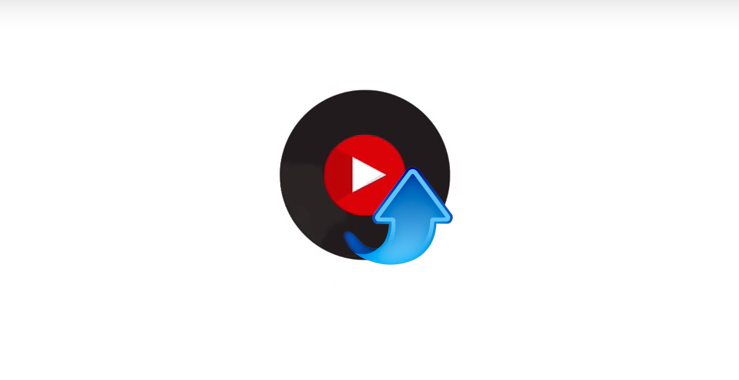

Youtube Music Uploader - Docker Image
====================================

[](https://hub.docker.com/r/jaymoulin/youtube-music-uploader/)
[](https://hub.docker.com/r/jaymoulin/youtube-music-uploader/)
[](https://www.paypal.me/jaymoulin)
[](https://www.buymeacoffee.com/jaymoulin)
[](https://patreon.com/jaymoulin)

(This product is available under a free and permissive license, but needs financial support to sustain its continued improvements. In addition to maintenance and stability there are many desirable features yet to be added.)

This image allows you to watch a folder and upload all new MP3 added to your Youtube Music Library.

Installation
---

```
docker run -d --restart=always -v /path/to/your/library:/media/library --name youtubemusic jaymoulin/youtube-music-uploader
```

You must define your path to your library in a volume to `/media/library`
You can also mount another volume to `/root/oauth` folder to retrieve your oauth key 

See environment variables to tweak some behaviour

Environment variables
---------------------

These environments variable will produce a different behaviour

* `REMOVE` Remove file on a successful upload (boolean, (default: false)) - pass to true if you want to remove files 
* `ONESHOT` Execute only once without listening to folder events (boolean, (default: false)) - pass to true if you want to execute only once (also remove `--restart=always` from docker parameters) 
* `LISTENER_ONLY` Listener only, upload files only when added not at start (boolean, (default: false)) - pass to true if you want to listen
* `DEDUP_API` Url to the deduplicate API (string (default: None)) - Will call deduplicate API before trying to sample and upload to Youtube Music
* `ERROR_FILE` Path to logs (string (default: None)) - Will logs into the specified file - default stderr

### Example
```
docker run -d --restart=always -v /path/to/your/library:/media/library --name youtubemusic -e REMOVE=true jaymoulin/youtube-music-uploader
```
will delete files on upload

Deduplicate
-----------

You can (un)mark files as duplicate thanks to the deduplicate API included.
For example, if you already know all your library was already uploaded to Youtube Music, you can mark all files as already uploaded in the deduplicate api.

```
docker exec youtubemusic youtube-music-upload-deduplicate --deduplicate_api http://172.17.0.1 -d /media/library
```

Consult [Youtube Music Uploader Deduplicate](https://github.com/jaymoulin/youtube-music-uploader#deduplicate) for further information.

Configuration
---
First, you have to allow the container to access your Google Music account
```
docker exec -ti youtubemusic auth
```
Then follow the setup instructions provided https://ytmusicapi.readthedocs.io/en/latest/setup.html#copy-authentication-headers.

Once done, restart the container to start watching your folder and uploading your MP3.
```
docker restart youtubemusic
```

Appendixes
---

### Install Docker

If you don't have Docker installed yet, you can do it easily in one line using this command
 
```
curl -sSL "https://gist.githubusercontent.com/jaymoulin/e749a189511cd965f45919f2f99e45f3/raw/0e650b38fde684c4ac534b254099d6d5543375f1/ARM%2520(Raspberry%2520PI)%2520Docker%2520Install" | sudo sh && sudo usermod -aG docker $USER
```


